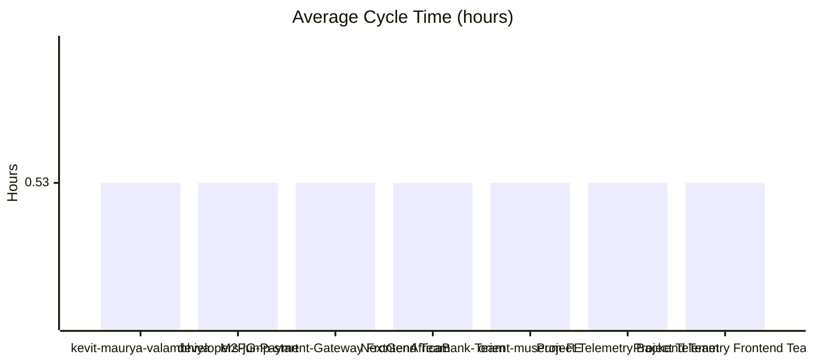
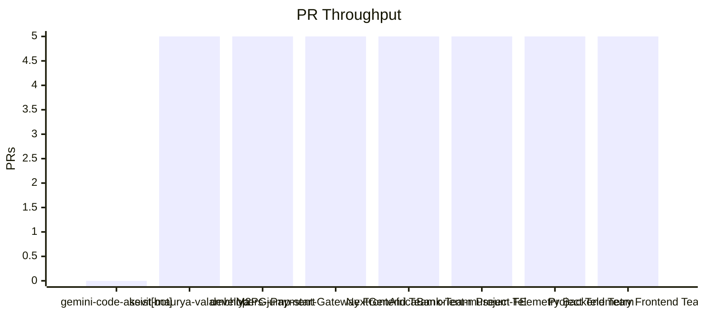

## Extended PR Metrics by Developer
| Developer | Cycle Time | PR Throughput | Average Coding Time | Review Waiting Time | Review Time | Total Comments | PR Size Mix | Avg Comments / PR | Requested Changes | Time to Address Changes | Average LOC +/- | Average Files Changed | PRs w/o Review | PRs w/o Approval |
| --- | --- | --- | --- | --- | --- | --- | --- | --- | --- | --- | --- | --- | --- | --- |
| gemini-code-assist[bot] | 0m | 0 | 0m | 0m | 0m | 0 | S:0 / M:0 / L:0 | 0.00 | 0 | 0m | +0.00 / -0.00 | 0.00 | 0 | 0 |
| kevit-maurya-valambhiya | 32m | 5 | 7m | 1m | 24m | 28 | S:2 / M:2 / L:1 | 5.60 | 0 | 0m | +281.00 / -70.00 | 9.00 | 0 | 5 |
| developers-jump-start | 32m | 5 | 7m | 1m | 24m | 28 | S:2 / M:2 / L:1 | 5.60 | 0 | 0m | +281.00 / -70.00 | 9.00 | 0 | 5 |
| M2PG-Payment-Gateway Frontend Team | 32m | 5 | 7m | 1m | 24m | 28 | S:2 / M:2 / L:1 | 5.60 | 0 | 0m | +281.00 / -70.00 | 9.00 | 0 | 5 |
| NextGenAfricaBank-Team | 32m | 5 | 7m | 1m | 24m | 28 | S:2 / M:2 / L:1 | 5.60 | 0 | 0m | +281.00 / -70.00 | 9.00 | 0 | 5 |
| orient-museum-FE | 32m | 5 | 7m | 1m | 24m | 28 | S:2 / M:2 / L:1 | 5.60 | 0 | 0m | +281.00 / -70.00 | 9.00 | 0 | 5 |
| Project Telemetry Backend Team | 32m | 5 | 7m | 1m | 24m | 28 | S:2 / M:2 / L:1 | 5.60 | 0 | 0m | +281.00 / -70.00 | 9.00 | 0 | 5 |
| Project Telemetry Frontend Team | 32m | 5 | 7m | 1m | 24m | 28 | S:2 / M:2 / L:1 | 5.60 | 0 | 0m | +281.00 / -70.00 | 9.00 | 0 | 5 |

